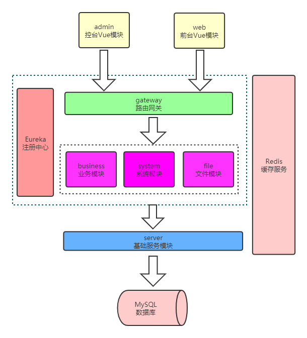

## 一、项目介绍

### 1. 项目简介：

此项目是一个类似慕课网，B2C的一个视频课程网站。

网站控台在系统管理方面，有一套通用的权限管理系统，包含用户，角色，资源的管理。在业务管理方面，能够管理讲师信息，创建视频课程，编辑课程内容，管理大章小节，上传视频，对课程一级二级分类进行管理等。

网站前台主要用于普通用户对课程的浏览和学习，包含了查看不同分类课程，对课程内容，课程讲师，课程大章小节，每小节视频的浏览。同时网站前台还提供了注册登录等功能，实现部分课程在登录报名后才能观看。

### 2. 技术选型：

- 系统主体采用 Vue + Spring Boot 的前后端分离架构
- 使用 Spring Cloud 组件 Eureka 作为注册中心、Gateway 作为路由网关
- 使用 Redis 作为缓存
- 使用 MyBatis 作为持久层框架，同时使用了 MyBatis-Generator 和 Page Helper 插件
- 数据库使用 MySQL
- 图形验证码 Kaptcha
- 代码生成器 Freemarker

### 3. 核心技术要点：

- 实现核心业务功能开发，包括课程、大章、小节、讲师、分类等功能的增删查改、分页查询;
- 不依赖第三方框架实现 RBAC 通用权限管理，包括资源的配置，读取，前后端的拦截;
- 实现大文件分片上传，断点续传功能，利用多线程并发合并多个分片，提升文件上传功能的响应速度;
- 基于 Redis 共享 Session 实现单点登录功能，基于 Redis 实现登录验证码校验功能，热门课程排行功能;
- 基于 Spring MVC 实现全局异常处理，基于 Spring AOP 改善日志的输出，为每一个请求设置唯一标识号，利用反射获取请求相关信息，提升日志的可读性;
- 使用了代码生成器 FreeMarker 和 MyBatis-Generator，以提升项目开发效率;
- 使用正则表达式，用于前端验证登录用户注册用户的信息

### 4. 访问演示地址：

网页前台：http://39.108.3.115:8081

网页控台：http://39.108.3.115:8080
控台用户名：root
控台用户密码：123

## 二、模块介绍和项目架构

### 1. 模块介绍：

- admin
	控台前端管理，vuecli 项目
- business
	核心业务模块，springboot 项目，包含课程，大章，小节，讲师的增删查改等业务
- doc
	项目相关的文档，包含项目数据库初始化脚本，资源Json。
- eureka
	注册中心，spring boot 项目
- file
	文件模块，spring boot 项目，管理系统中文件的上传等功能
- gateway
	路由模块，spring boot 项目，主要用于路由转发和拦截
- generator
	代码生成器，用于生成前端，后端 Controller 层，Service 层代码
- server
	公共jar模块，被 business ,file, system 依赖，其中包含业务的 service 层和持久层。
- system
	系统模块，spring boot 项目，包含控台用户，前台用户的管理和登录注册等业务功能。
- web
	网站前端模块，vuecli项目

### 2. 架构图：

## 项目的初始化

开发项目环境说明：

- 系统：Windows 10
- JDK 版本：1.8
- IntelliJ IDEA 版本：2019
- MySQL：8.0.11
- Redis：3.2.12

项目初始化步骤：

1. 配置好本地环境（Idea, nodejs, jdk1.8, mysql8.0, vue cli, redis）
2. 还原数据库文件，数据库sql文件在doc目录下
3. 下载导入源码，用idea打开，刷新maven依赖
4. 初始化web模块和admin模块，（cd web npm install / cd admin npm install）
5. 更改模块中application.properties文件，把自己的redis和mysql配置信息加入
6. 运行项目

